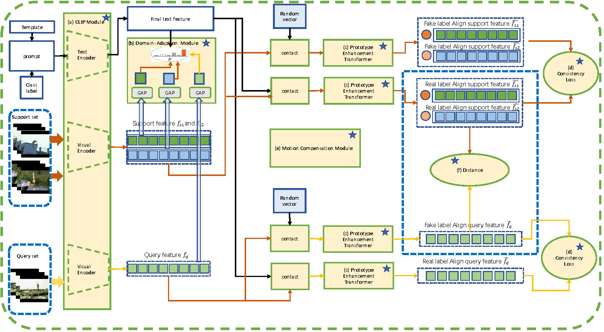

#Consistency Prototype Module and Motion Compensation for Few-Shot Action  Recognition (CLIP-CPM^2C)

## Abstract 

Recently, few-shot action recognition has significantly progressed by learning the feature discriminability and designing suitable comparison methods. 
Still, there are the following restrictions. (a) Previous works are mainly based on visual mono-modal. Although some multi-modal works use labels as 
supplementary to construct prototypes of support videos, they can not use this information for query videos. The labels are not used efficiently. 
(b) Most of the works ignore the motion feature of video, although the motion features are essential for distinguishing. We proposed a Consistency 
Prototype and Motion Compensation Network(CLIP-CPM^2C) to address these issues. Firstly, we use the CLIP for multi-modal few-shot action recognition 
with the text-image comparison for domain adaption. Secondly, in order to make the amount of information between the prototype and the query more similar, 
we propose a novel method to compensate for the text(prompt) information of query videos when text(prompt) does not exist, which depends on a Consistency Loss. 
Thirdly, we use the differential features of the adjacent frames in two directions as the motion features, which explicitly embeds the network with motion dynamics. 
We also apply the Consistency Loss to the motion features. Extensive experiments on standard benchmark datasets demonstrate that the proposed method can compete 
with state-of-the-art results. 

## Framework

